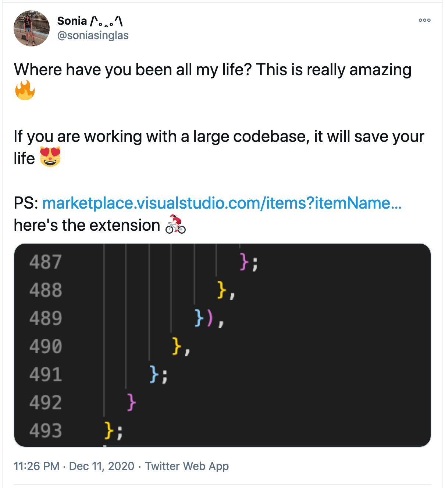

I have been coding for a while now, and identifying blocks, notations, opening and closing tags within heavily nested loops and functions is more of a nightmare for me.

Recently, I get to know about the [Bracket Pair Colorizer extension](https://marketplace.visualstudio.com/items?itemName=CoenraadS.bracket-pair-colorizer-2) in Visual Studio Code, life savior extension! This extension allows matching brackets to be identified with colours. By default `()`, `[]`, and `{}` are matched, however, custom bracket characters can also be configured.

It enhances the way that we write code and helps in a better understanding of the mess going on, in the code editor.

You can install [Bracket Pair Colorizer](https://marketplace.visualstudio.com/items?itemName=CoenraadS.bracket-pair-colorizer-2) using the VS Code extension marketplace. Hit install and make sure to reload after installation 🤗

## **Cheers & Happy Sharing! ❤️**