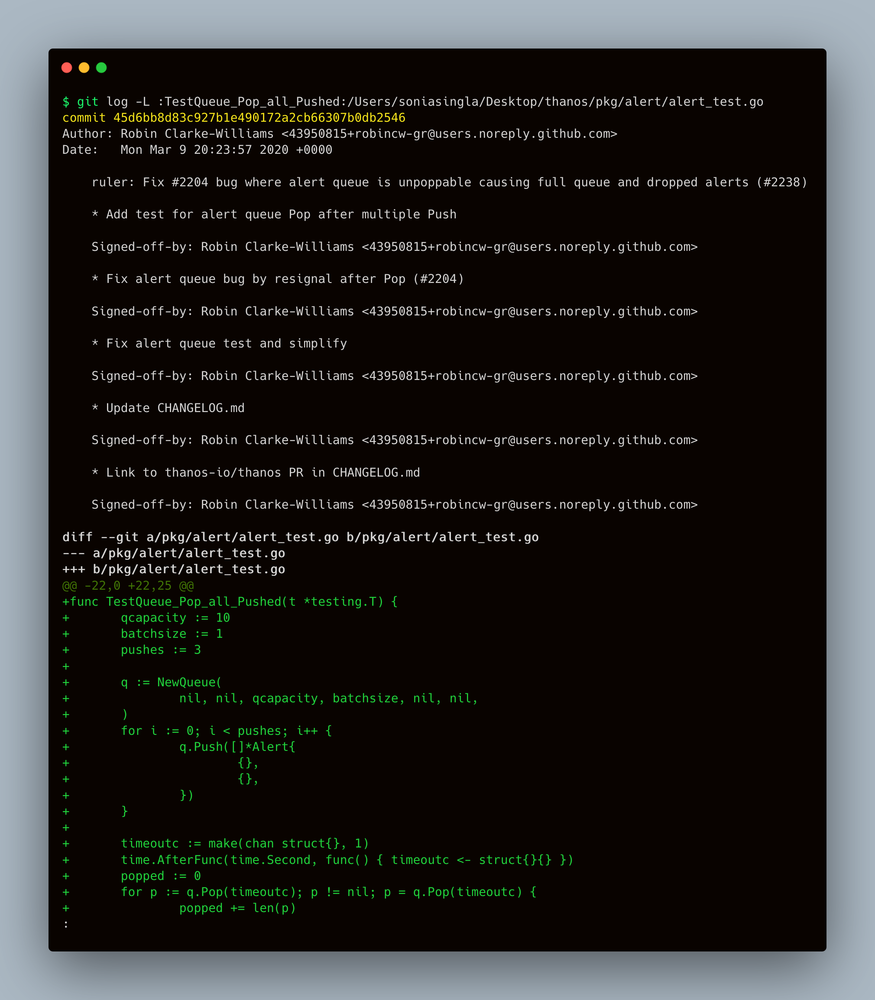

The `git log` command helps us to view the information about previous commits occurred in the project. But do you know, you can see the history of any method/function in your codebase easily with:

```bash
git log -L :function:path/to/file
```

A quick example on this command:



It cannot necessarily handle all the languages, for that, you need to configure the git config correctly in order for git to recognize method/function declarations in that specific language.
I checked for `Golang`, `JavaScript`, `Python` and `C`, it's working without adding any particular language-specific configuration.

Interestingly, if you wish to check the history for some specific number of lines within the file, you can check with:

```bash
$ git log -L :<start>,<end>:<file>
```

You can also pass regex to find anything in your codebase files using:

```bash
git log -L :<regex>:<file>
```

This was originally posted [here](https://stackoverflow.com/questions/4781405/git-how-do-i-view-the-change-history-of-a-method-function)! 💜
